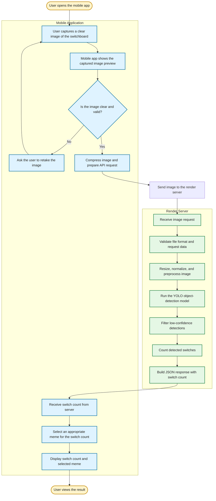

# [Project Name] 🎯


## Basic Details
### Team Name: [Name]


### Team Members
- Team Lead: Rhithujith P - School of engineering,CUSAT
- Member 2: Sruthindev R S -School of engineering,CUSAT


### Project Description
Mobile App which count the number of Switches which have been turned on and will give memes according to it

### The Problem (that doesn't exist)
Blind Mobile users who can't see switchboard but can take pictures of it

### The Solution (that nobody asked for)
Mobile App for counting switches

## Technical Details
### Technologies/Components Used
For Software:
- Python,Dart
- Fastapi
- Numpy
- Docker

For Hardware:


### Implementation
For Software:



# Installation
Front end:
```bash
cd frontend
flutter pub get
```

# Run
For debugging:
```bash
flutter run
```

To build the release APK:
```bash
flutter build apk --release
```
Backend:
The backend is hosted on Render, so it does not need to be run locally for normal use. To test the backend locally:
```bash
cd backend
pip install -r requirements.txt
uvicorn app:app --reload
```


### Project Documentation
For Software:
    Flutter : Flutter is used as it is crossplatform and easy
    Python & fast api:Python is easy for 

# Screenshots (Add at least 3)

*Add caption explaining what this shows*


*Add caption explaining what this shows*


*Add caption explaining what this shows*

# Diagrams

*Add caption explaining your workflow*

For Hardware:

# Schematic & Circuit

*Add caption explaining connections*


*Add caption explaining the schematic*

# Build Photos

*List out all components shown*


*Explain the build steps*


*Explain the final build*

### Project Demo
# Video
[Add your demo video link here]
*Explain what the video demonstrates*

# Additional Demos
[Add any extra demo materials/links]

## Team Contributions
- [Name 1]: [Specific contributions]
- [Name 2]: [Specific contributions]
- [Name 3]: [Specific contributions]

---
Made with ❤️ at TinkerHub Useless Projects 


